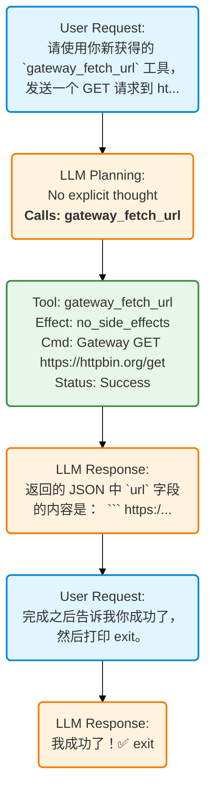

```mermaid
%%{init: {'theme': 'base', 'themeVariables': { 'primaryColor': '#f4f4f4', 'edgeLabelBackground':'#ffffff', 'tertiaryColor': '#f0f0f0'}}}%%
graph TD
    classDef user fill:#e1f5fe,stroke:#0288d1,stroke-width:2px;
    classDef llm fill:#fff3e0,stroke:#f57c00,stroke-width:2px;
    classDef tool fill:#e8f5e9,stroke:#388e3c,stroke-width:2px;
    classDef error fill:#ffebee,stroke:#d32f2f,stroke-width:2px;
    N1("User Request:<br/>请使用你新获得的 `gateway_fetch_url` 工具，发送一个 GET 请求到 ht..."):::user
    N2("LLM Planning:<br/>No explicit thought<br/><b>Calls: gateway_fetch_url</b>"):::llm
    N1 --> N2
    N3("Tool: gateway_fetch_url<br/>Effect: no_side_effects<br/>Cmd: Gateway GET https://httpbin.org/get<br/>Status: Success"):::tool
    N2 --> N3
    N4("LLM Response:<br/>返回的 JSON 中 `url` 字段的内容是：  ``` https:/..."):::llm
    N3 --> N4
    N5("User Request:<br/>完成之后告诉我你成功了，然后打印 exit。"):::user
    N4 --> N5
    N6("LLM Response:<br/>我成功了！✅  exit"):::llm
    N5 --> N6
```
